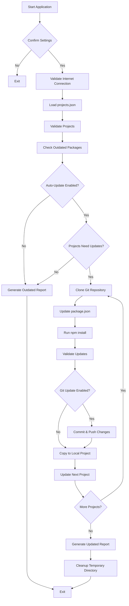

# Auto Packages Updater

A Node.js automation tool to scan multiple projects for outdated NPM packages and automatically update them with Git integration.

Built in April 2021 (Updated 2026). This application reads project configurations from an external JSON file, checks for outdated NPM packages across multiple projects simultaneously, generates detailed reports, and optionally auto-updates packages in both local projects and their Git repositories.

## Features

- 📦 Scans multiple projects for outdated NPM packages
- 🔄 Auto-updates packages with configurable limits
- 📊 Generates detailed reports with statistics
- 🔀 Git integration for automated commits and pushes
- 🎯 Custom package lists for selective updates
- 🚫 Exclude specific packages from updates
- 🔁 Retry mechanism for failed updates
- 🌳 Support for parent/child project structures (monorepos)
- 🧪 Simulate mode for testing without making changes
- ⚡ Configurable timeouts and limits
- 📝 Comprehensive logging and error tracking

## Getting Started

### Prerequisites

- Node.js (v14 or higher)
- npm or yarn
- Git (for auto-update features)
- GitHub credentials configured (for Git push operations)

### Installation

1. Clone the repository:
```bash
git clone https://github.com/orassayag/auto-packages-updater.git
cd auto-packages-updater
```

2. Install dependencies:
```bash
npm install
```

3. Create your projects configuration file:
```bash
cp misc/examples/projects.json sources/projects.json
```

4. Edit `sources/projects.json` with your project paths

### Configuration

Edit the settings in `src/settings/settings.js`:

```javascript
const settings = {
  GITHUB_URL: 'https://github.com/yourusername',
  DIST_OUTDATED_FILE_NAME: 'outdated',
  DIST_UPDATED_FILE_NAME: 'updated',
  MAXIMUM_PROJECTS_COUNT: 100,
  IS_AUTO_UPDATE: true,
  IS_SIMULATE_UPDATE_MODE: false,
  PROJECTS_PATH: pathUtils.getJoinPath({
    targetPath: __dirname,
    targetName: '../../sources/projects.json',
  }),
};
```

Key settings:
- `IS_AUTO_UPDATE`: Enable/disable automatic package updates
- `IS_LOG_ONLY_UPDATES`: Log only projects with available updates
- `IS_SIMULATE_UPDATE_MODE`: Test mode without making actual changes
- `MAXIMUM_PROJECTS_COUNT`: Maximum number of projects to process
- `MAXIMUM_PROJECTS_UPDATE_COUNT`: Maximum number of projects to auto-update

### Projects Configuration

Create a `sources/projects.json` file with your project configurations:

```json
[
  {
    "name": "my-project",
    "display-name": "My Awesome Project",
    "update-type": "full",
    "project-path": "C:\\path\\to\\my-project",
    "git-root-path": "my-project",
    "parent-project-path": null,
    "custom-packages-path": null,
    "exclude-packages-list": ["deprecated-package"],
    "include-dev-dependencies": true,
    "is-packages-update": true,
    "is-git-update": true
  }
]
```

See `misc/examples/projects.json` for a complete example.

## Available Scripts

### Check for Outdated Packages
```bash
npm start
```

Scans all configured projects and generates a report of outdated packages.

### Auto-Update Packages
When `IS_AUTO_UPDATE: true` in settings, the script will:
1. Check for outdated packages
2. Clone repositories to temporary directory
3. Update package.json and package-lock.json
4. Run npm install
5. Commit and push changes to Git (if enabled)
6. Update local project files

### Create Backup
```bash
npm run backup
```

Creates a timestamped backup of the application in the `backups/` directory.

### Sandbox Testing
```bash
npm run sand
```

Run sandbox tests for development purposes.

## Project Structure

```
auto-packages-updater/
├── src/
│   ├── core/
│   │   ├── models/          # Data models
│   │   └── enums/           # Enumerations
│   ├── services/            # Business logic services
│   │   ├── application.service.js
│   │   ├── project.service.js
│   │   ├── package.service.js
│   │   └── git.service.js
│   ├── logics/              # Main application logic
│   ├── scripts/             # Entry point scripts
│   ├── utils/               # Utility functions
│   └── settings/            # Configuration settings
├── sources/                 # Project configuration files
│   └── projects.json
├── dist/                    # Generated reports
├── backups/                 # Application backups
├── misc/                    # Miscellaneous files
│   └── examples/
└── package.json
```

## Workflow Diagram



## Output Reports

### Outdated Packages Report
Located in `dist/outdated-[timestamp].txt`:

```
===my-project 05/24===
express: ^4.17.1 => ^4.18.2
mongoose: ^5.12.3 => ^6.0.12
lodash: ^4.17.20 => ^4.17.21

===another-project 00/15===
success | All packages up to date.
```

### Updated Packages Report
Located in `dist/updated-[timestamp].txt`:

Shows which projects were successfully updated and which packages were changed.

## Configuration Examples

### Full Update (All Packages)
```json
{
  "name": "my-project",
  "update-type": "full",
  "project-path": "C:\\projects\\my-project",
  "git-root-path": "my-project",
  "exclude-packages-list": null,
  "include-dev-dependencies": true,
  "is-packages-update": true,
  "is-git-update": true
}
```

### Custom Update (Specific Packages)
```json
{
  "name": "my-project",
  "update-type": "custom",
  "project-path": "C:\\projects\\my-project",
  "git-root-path": "my-project",
  "custom-packages-path": "C:\\custom-packages.txt",
  "exclude-packages-list": null,
  "include-dev-dependencies": true,
  "is-packages-update": true,
  "is-git-update": true
}
```

Create `custom-packages.txt` with one package name per line:
```
express
mongoose
lodash
```

### Exclude Specific Packages
```json
{
  "name": "my-project",
  "update-type": "full",
  "exclude-packages-list": ["log-update", "deprecated-package"],
  "is-packages-update": true,
  "is-git-update": true
}
```

## Features in Detail

### Auto-Update Flow
1. **Validation**: Checks internet connection and project configurations
2. **Scanning**: Identifies outdated packages using npm-check-updates
3. **Selection**: Randomly selects projects if exceeding the maximum update count
4. **Cloning**: Clones Git repositories to temporary directory
5. **Updating**: Updates package.json with new versions
6. **Installation**: Runs npm install to generate new package-lock.json
7. **Validation**: Verifies all packages were updated successfully
8. **Git Operations**: Commits and pushes changes (if enabled)
9. **Local Update**: Copies updated files to original project directory
10. **Cleanup**: Removes temporary files and directories

### Retry Mechanism
- Configurable number of retries per project
- Automatic retry on failure
- Logs retry attempts in reports

### Parent/Child Projects
- Supports monorepo structures
- Processes parent projects first
- Optimizes Git operations

### Simulate Mode
- Test the entire flow without making changes
- Useful for validating configurations
- Set `IS_SIMULATE_UPDATE_MODE: true`

## Error Codes

All errors include unique codes (1000001-1000038) for troubleshooting:

- `1000019-1000020`: File reading errors
- `1000021-1000035`: Project validation errors
- `1000036-1000037`: Temporary directory errors
- `1000038`: Invalid project status

## Development

### Built With
- [Node.js](https://nodejs.org/) - Runtime environment
- [npm-check-updates](https://www.npmjs.com/package/npm-check-updates) - Check for outdated packages
- [fs-extra](https://www.npmjs.com/package/fs-extra) - Enhanced file operations
- [is-reachable](https://www.npmjs.com/package/is-reachable) - Check internet connectivity
- [Git](https://git-scm.com) - Version control operations

### Testing
Test with various configurations:
- Single vs multiple projects
- Full vs custom update types
- With and without devDependencies
- Exclude package lists
- Parent/child project structures
- Git update enabled/disabled

## Contributing

Contributions to this project are [released](https://help.github.com/articles/github-terms-of-service/#6-contributions-under-repository-license) to the public under the [project's open source license](LICENSE).

Everyone is welcome to contribute. See [CONTRIBUTING.md](CONTRIBUTING.md) for details on:
- Reporting issues
- Submitting pull requests
- Code style guidelines
- Testing guidelines

## Versioning

We use [SemVer](http://semver.org) for versioning. For the versions available, see the [tags on this repository](https://github.com/orassayag/auto-packages-updater/tags).

## Author

* **Or Assayag** - *Initial work* - [orassayag](https://github.com/orassayag)
* Or Assayag <orassayag@gmail.com>
* GitHub: https://github.com/orassayag
* StackOverflow: https://stackoverflow.com/users/4442606/or-assayag?tab=profile
* LinkedIn: https://linkedin.com/in/orassayag

## License

This application has an MIT license - see the [LICENSE](LICENSE) file for details.

## Acknowledgments

- Built to streamline package management across multiple projects
- Designed for developers managing multiple Node.js applications
- Automates the tedious task of keeping dependencies up to date
